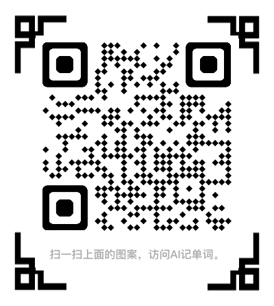

# AI记单词（人工智能记单词）

## [AI记单词（人工智能记单词）](https://www.xianglesong.com)

### AI记单词哲学

* 词汇一切的基础，无论听说读写
  * 先掌握一万个再说，有统计表明，词汇量达到了10000，大概可以读懂95.05%的《经济学人》，基本可以理解文本内容。
* 想了诵 <https://www.xianglesong.com>
  * 想明白了再背诵，否则就是死记硬背。
* 日积月累
  * 母语你都学很多年，何况第二外语，要花时间和精力，绝不要想一戳而就。一天背10个单词，10000个也需要1000天，也需要3年左右的时间。

### 网站导航

* [基础](/课程/基础/README.md)
  * [字母](/课程/基础/字母/README.md) | [音标](/课程/基础/音标/README.md) | [前缀](/课程/基础/前缀/README.md) | [后缀](/课程/基础/后缀/README.md) | [词根](/课程/基础/词根/README.md) | [音律](/课程/基础/音律/README.md) | [记忆](/课程/基础/记忆/README.md)

* [课程](/课程/README.md)
  * 人工智能记单词
    * [日积月累](/课程/日积月累/README.md)
  * 词汇累积计划（7000）
    * [1000基础英语词汇](/课程/词汇累积计划/1000基础英语词汇/README.md)
    * [2000核心英语词汇](/课程/词汇累积计划/2000核心英语词汇/README.md)
    * [4000基本英语词汇](/课程/词汇累积计划/4000基本英语词汇/README.md)
  * 新概念英语
    * [新概念第一册词汇](/课程/新概念英语/新概念英语第一册/新概念英语第一册词汇/README.md)
    * [新概念第二册词汇](/课程/新概念英语/新概念英语第二册/新概念英语第二册词汇/README.md)
    * [新概念第三册词汇](/课程/新概念英语/新概念英语第三册/新概念英语第三册词汇/README.md)
    * [新概念第四册词汇](/课程/新概念英语/新概念英语第四册/新概念英语第四册词汇/README.md)
  * 考试
    * [中考英语词汇](/课程/中考/中考英语/中考英语词汇/README.md)
    * [高考英语词汇](/课程/高考/高考英语/高考英语词汇/README.md)
    * [大学英语四级词汇](/课程/大学英语四级/大学英语四级词汇/README.md)
    * [大学英语六级词汇](/课程/大学英语六级/大学英语六级词汇/README.md)
    * [硕士研究生英语词汇](/课程/考研/硕士研究生英语词汇/README.md)

* [资源](/资源/README.md)
  * [免费](/资源/免费/README.md)
  * [收费](/资源/收费/README.md)
  * [私定](/资源/私定/README.md)
  * [私藏](/资源/私藏/README.md)

* [索引](/课程/单词/README.md)
  * [A](/课程/单词/A/README.md) | [B](/课程/单词/B/README.md) | [C](/课程/单词/C/README.md) | [D](/课程/单词/D/README.md) | [E](/课程/单词/E/README.md) | [F](/课程/单词/F/README.md) | [G](/课程/单词/G/README.md) | [H](/课程/单词/H/README.md) | [I](/课程/单词/I/README.md) | [J](/课程/单词/J/README.md) | [K](/课程/单词/K/README.md) | [L](/课程/单词/L/README.md) | [M](/课程/单词/M/README.md) | [N](/课程/单词/N/README.md) | [O](/课程/单词/O/README.md) | [P](/课程/单词/P/README.md) | [Q](/课程/单词/Q/README.md) | [R](/课程/单词/R/README.md) | [S](/课程/单词/S/README.md) | [T](/课程/单词/T/README.md) | [U](/课程/单词/U/README.md) | [V](/课程/单词/V/README.md) | [W](/课程/单词/W/README.md) | [X](/课程/单词/X/README.md) | [Y](/课程/单词/Y/README.md) | [Z](/课程/单词/Z/README.md)

