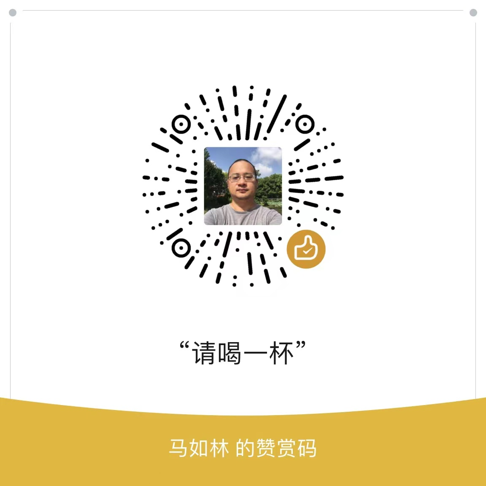

# 英语学习和实战指南

## 愿景

结合使用人工智能的方法学习和使用英语。

## 目录

- [英语学习和实战指南](#英语学习和实战指南)
  - [愿景](#愿景)
  - [目录](#目录)
  - [词汇](#词汇)
    - [Vocabulary Build Up](#vocabulary-build-up)
      - [1000 Basic English Words](#1000-basic-english-words)
      - [2000 Core English Words](#2000-core-english-words)
      - [4000 Essential English Words](#4000-essential-english-words)
    - [English Vocabulary in Use](#english-vocabulary-in-use)
      - [English Vocabulary in Use Elementary](#english-vocabulary-in-use-elementary)
      - [English Vocabulary in Use Pre-Intermediate Intermediate](#english-vocabulary-in-use-pre-intermediate-intermediate)
      - [English Vocabulary in Use Upper-Intermediate](#english-vocabulary-in-use-upper-intermediate)
      - [English Vocabulary in Use Advanced](#english-vocabulary-in-use-advanced)
    - [Word Power Made Easy](#word-power-made-easy)
  - [语法](#语法)
    - [剑桥语法](#剑桥语法)
      - [Essentinal Grammar in Use](#essentinal-grammar-in-use)
      - [English Grammar in Use](#english-grammar-in-use)
      - [Advanced Grammar in Use](#advanced-grammar-in-use)
  - [听力](#听力)
    - [Listen to This](#listen-to-this)
      - [Listen to This 1](#listen-to-this-1)
      - [Listen to This 2](#listen-to-this-2)
      - [Listen to This 3](#listen-to-this-3)
  - [口语](#口语)
    - [发音](#发音)
  - [阅读](#阅读)
    - [RAZ阅读](#raz阅读)
  - [写作](#写作)
  - [课程](#课程)
    - [新概念英语](#新概念英语)
      - [新概念英语第一册](#新概念英语第一册)
      - [新概念英语第二册](#新概念英语第二册)
      - [新概念英语第三册](#新概念英语第三册)
      - [新概念英语第四册](#新概念英语第四册)
  - [赞赏](#赞赏)

## 词汇

### Vocabulary Build Up

#### 1000 Basic English Words

#### 2000 Core English Words

#### 4000 Essential English Words

### English Vocabulary in Use

#### English Vocabulary in Use Elementary

#### English Vocabulary in Use Pre-Intermediate Intermediate

#### English Vocabulary in Use Upper-Intermediate

#### English Vocabulary in Use Advanced

### Word Power Made Easy

## 语法

### 剑桥语法

#### Essentinal Grammar in Use

#### English Grammar in Use

#### Advanced Grammar in Use

## 听力

### Listen to This

#### Listen to This 1

#### Listen to This 2

#### Listen to This 3

## 口语

### 发音

[视频][BBC发音](https://www.bilibili.com/video/BV1Y4411M7Ac?)

## 阅读

### RAZ阅读

## 写作

[图书]美国大学英语写作(College Writing Skills with Readings)

## 课程

### 新概念英语

#### 新概念英语第一册

#### 新概念英语第二册

#### 新概念英语第三册

#### 新概念英语第四册

## 赞赏

