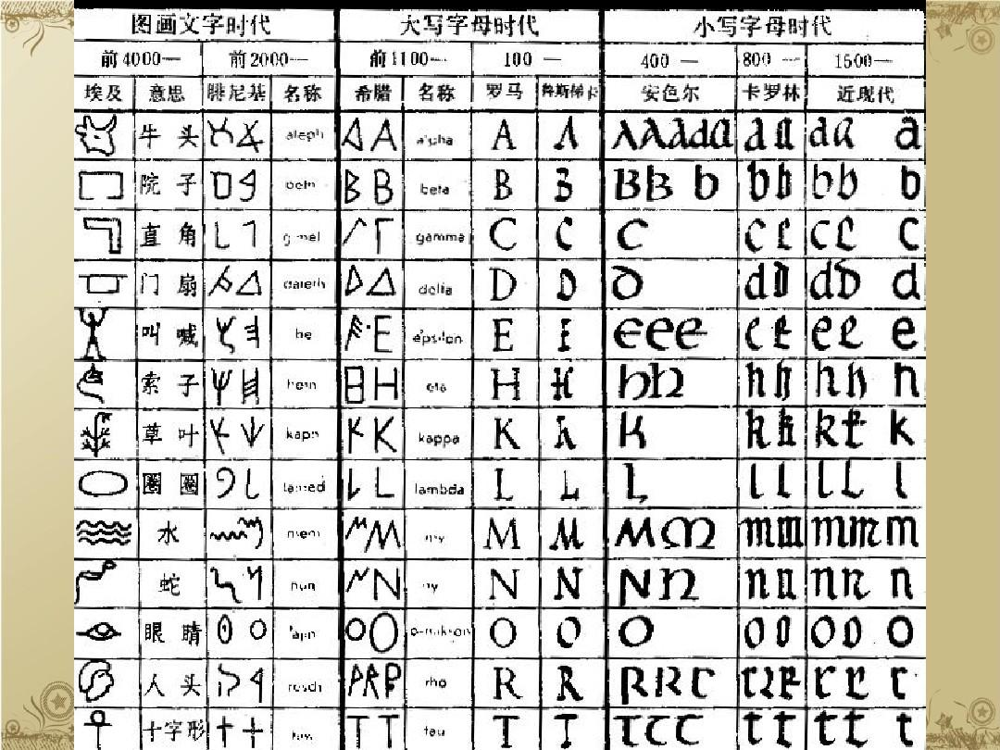

# 词汇密码-英语字母起源及其音形义演化发展

背单词，很痛苦，那是你没有掌握正确的方法，看了本文章，你能知道字母的来龙去脉，有逻辑的记单词，可以深入理解词汇的奥秘，完全做到有的放矢，知其然也知其所以然，必然事倍功半。本文对英语字母的象形，衍生意义的产生逻辑和语音等内容进行讲解说明，通过该学习和理解你就能做到。如果你是英语学习者，绝对值得拥有和阅读，轻轻松松记单词。

语言和文字的产生是人类进化和发展的重要产物，人类获得语言能力，不仅使人类可以进行更为复杂和抽象的思维，也使人类可以进行更为高效的交流与合作。语言的产生奠定了人类文明的基础，使人类可以记录和传播知识，促进科技与文化的发展。人类的发展也推动了语言的变化和丰富。人类不断发明新的工具、创造新的概念，这需要新的语言来描述；人类的迁徙和交流也促进了语言的扩散、变异和融合。语言和人类发展相辅相成并相互促进。

## 英语演变

字母起源拉丁文字，A是因为牛对古人的重要性，首先被创造，B，C等类似，最初有21个字母，后引入了希腊字母Y和Z，从I分离出J，从U分化出V，两个V变成W。主要是拉丁，埃及，希腊，罗马，日耳曼，古印度等语言融合。

* 大写字母主要来自于象形及其衍生意义
  * 人类认识事物的一般特征
* 首先有大写字母，后才有小写字母
  * 小写字母主要是为了书写方便
* 音行义的融汇贯通是学习语言的基础和核心
  * 音也是重要因素，因为考试不容易考，所以往往忽视其重要性
* 逻辑对语言和文字的创造和延续很重要
  * 形到义的衍生一般符合逻辑，人类才能容易理解、记忆并被认可，被传播，被延续

## 字母表

* A-a
  * A字母象形牛角（腓尼基人牛角的象形，古希腊进行倒写，闪米特语族的公牛的意思，牛对农业社会里的古人很重要，所以放在第一位），从牛角衍生出角，弧度，高，尖，反对，否定，后腿，削弱，工具，第一，重要，开始，农业等意义；也有说法是人的象形。比如
    * angle（角）
    * arc（弧度）
    * air（空气）
    * arrow（弓箭）
    * against（反对）
    * attack（攻击）
    * alphabet（字母表）
    * agriculture（农业，农学，农艺）
    * adult（成年人）
* B-b
  * B字母象形房屋（字母表中排在第二位也许是因为住的重要性仅次于食），从地基衍生出仓库，创立，基础等意义；也有说像怀孕的肚子，从而衍生出身体，凸形等意义；B有2的象形及衍生意义；小写b有底部的象形意义，b和d也有对称意义；B声音有爆炸的意义。
    * base（基底）
    * build（建立）
    * born（出生）
    * baby（婴儿）
    * ball（球）
    * both（两个）
    * bottom（底部）
    * bar（棒）
    * boom（爆炸）
* C-c
  * C字母一种说法是山洞的象形，是人类最初居住的地方。对于古代的人们来说，天然的山洞自然就成了最佳的栖息之地。从山洞衍生出房子，居住地，文明等意义。也有一种说法是骆驼的驼峰象形。C的象形也有镰刀，弯曲，切割，破碎，分类，农业，圆，口等意义。
    * city（城市）
    * civil（文明的）
    * camel（骆驼）
    * cut（切）
    * corn（玉米）
    * circle（圆形）
    * cry（哭）
    * claw（爪子）
* D-d
  * 字母D逆时针旋转90度，就是门的形状，原来是个三角形后来变成圆形的，从门衍生出分开，家里相关的人、事、物，睡觉意义；D原来的三角形也有武器及抵抗等意义，中文发音也有"抵"的意思。D的半圆形也有圆的意义。古埃及也和死亡有关。
    * door（门）
    * divide（分开）
    * dad（爸爸）
    * dream（睡觉）
    * delta（三角形物）
    * defense（防御）
    * day（圆形的太阳和月亮）
    * down（向下）
    * disagree（不同意）
    * dead（死亡）
* E-e
  * E字母的一种说法是象举起双手的人，衍生出祈祷的意义；E字母上下相等，衍生公平、公正、相等的意义；也有象眼睛和窗户的说法，眼睛看到的就有存在的衍生意义；另外小写的e类似椭圆也有其衍生意义。
    * excite（激动）
    * eager（渴望，渴求）
    * equal（相等；平等的）
    * eye（眼睛）
    * exist（存在）
    * egg（蛋）
* F-f
  * F字母原始的腓尼基更像Y，古希腊修改为类似现在的F，罗马人再修改为F。从F看就有权杖（表神权和生命），武器，飞鸟（表飞），流动，羽毛，分叉等基础含义。
    * faith（信仰）
    * female（女性）
    * fair（公平的）
    * fight（战斗）
    * fly（飞）
    * flag（旗帜）
    * flow（流动）
    * feather（羽毛）
    * fork（刀叉的叉子）
    * flower（花）
* G-g
  * G字母是大地上长出东西的象形，并衍生出萌发，新生，伟大等其他意义；也有说法是C的变形，表示带门的房子，也有区分[g]和[k]的发音的说法。
    * ground（地面）
    * give（给（大地给予万物））
    * god（神）
    * globe（地球）
    * egg（鸡蛋）
    * gene（基因）
    * great（伟大）
    * gate（门口）
    * grab（攫取）
    * finger（手指）
* H-h
  * H字母源自于梯子象形，衍生出高，神，站立的人，安居，小屋等意义；也有说篱笆的象形，衍生出家等意义；通wh，衍生疑问的意义。
    * high（高）
    * height（高）
    * hill（山）
    * heaven（天堂）
    * he（他（高的人象形））
    * home（家）
    * house（房屋）
    * who（谁）
* I-i
  * I字母从形状上看就是站立的人或直线，也有说是手和手臂的象形；小写i像有头脑的人，衍生出思想；i也像水滴下的样子，衍生出水的意思；i也像火苗的样子，衍生小，圆点等意义。
    * I（我）
    * idea（思想）
    * line（线）
    * ice（冰）
    * ink（墨水）
    * fire（火）
    * little（小的）
* J-j
  * J字母象形钩子或跳跃的人，衍生出连接、突出等意思；I的变形，衍生出滴水的意义；I思考的人，J实战的人，J比I多了个脚；从Jupiter（木星）也有一些衍生意义；J和Y都是钩子造型，有一定程度互换。
    * join（连接）
    * jump（跳）
    * juice（果汁）
    * Jupiter（木星，神，主管法律和秩序，幸运之神）
    * joy（高兴）
    * junior（年幼的，初级的）
* K-k
  * K字母源自手的象形，衍生出打结，连接，掌控等意义，也有C、G、K和Q相互替换的衍生意义。
    * keep（保持）
    * kill（杀）
    * knot（打结）
    * king（国王）
    * clap（鼓掌）
    * catch（抓住）
    * control（控制）
* L-l
  * L字母是鞭子的象形，衍生出权杖，领导，权威，同时L字形也表示长和高的意思，也衍生出活，生活等意义。
    * lash（鞭打；睫毛）
    * let（让；允许，同意）
    * letter（字母）
    * learn（学习）
    * lead（引领）
    * leg（腿）
    * long（长）
    * length（长度）
    * lift（举，升起）
    * live（生存，活着；生活在；居住；生长，栖息）
* M-m
  * M字母源自水波纹的象形，字母"M"的起源是带有五个波峰的垂直波浪线，象征着水，闪米特人将线减少为三波，腓尼基人又去除了一波。从水衍生出壮观，强大，数量，多少，度量，哺乳等意义；也有山的形状，中间等意义；手的形状，跟汉字"爪"非常相似。
    * milk（牛奶）
    * mud（泥浆）
    * mobile（流动）
    * miracle（奇迹）
    * many（许多的）
    * much（许多的）
    * measure（度量）
    * mum（母亲）
    * middle（中间）
    * mountain（山）
    * move（移动）
    * man（男人）
    * make（制作）
    * money（钱）
* N-n
  * N字母是埃及符号，它最初看起来像是在代表眼镜蛇或蛇的较大波纹之上的一个小波纹。古闪米特人赋予它音n，象征"鱼"。也有从象形看是鼻子（2个竖线和上面1个横线，类似脸上连在一起的2个鼻孔），也有发芽，否定，连接，网络，门形，高等衍生意义等说法。
    * nose（鼻子）
    * new（新的）
    * no（否定）
    * not（否定）
    * none（没有）
    * near（附近）
    * next（接下来）
    * net（网，网络）
    * in（在...内）
    * on（在...上）
* O-o
  * O字母在古埃及是眼睛的象形，就有光学衍生意义，另外也有嘴，圆形等象形及衍生意义。
    * look（看）
    * optical（光学的、眼镜的）
    * mouth（嘴）
    * on（开）
    * off（关）
    * hole（洞）
    * dot（点）
    * onion（洋葱，洋葱头）
    * orange（橙子，橙色的）
* P-p
  * P字母在古代闪米特语中，今天的字母"P"看起来像一个倒置的"V"，意思是"嘴巴"，腓尼基人将它的顶部变成了斜钩形，公元前200年，罗马人将它向右翻转并闭合环以形成"P"。P衍生出人，嘴，纸，尖，高等意义，发音类似汉语"平"，也有平原等意义。
    * people（人）
    * public（公共的）
    * lip（嘴唇）
    * phone（电话）
    * play（戏剧）
    * paper（纸）
    * picture（图）
    * pin（针）
    * peak（山峰）
    * point（指，指向；要点，核心问题）
    * up（向上；上涨）
    * top（ 顶端；表面；最高的级别；尽头）
    * plain（平原）
    * plan（平面图，详图；计划，打算；规划；设计）
* Q-q
  * Q字母最初表示猴子的尾巴，被写成一个垂直线穿过的圆圈，后来改写成今天这个形式。疑问的意思我想象嘴巴里的舌头在说话，表示疑问，也有方形的说法，就是Q象形正方形，也有口的象形，疑问等衍生意义。
    * square（正方形）
    * quarter（四分之一，正方形四个边，一个就是1/4）
    * quiet（安静的；安定的；不动的；温顺的；安静；和平）
    * quit（退出；离开）
    * question（疑问）
    * query（询问）
* R-r
  * R字母是人面朝左的轮廓，是闪米特人书写的字母"R"的原始形状，意思是"头"，罗马人将它向右转，并添加了一个倾斜的脚。也有说法R上面是太阳的意义，从而衍生出光，发散等意义；上面的圆衍生出口的意义；也有说像发芽的形状，并有其相关衍生意义。
    * run（跑）
    * red（红色；红色的）
    * rise（升起，上升，增加）
    * round（圆形的）
    * ray（光线）
    * radius（半径，辐射范围）
    * round（圆形的，球形的；圆弧的）
    * around（围绕，环绕；大约；周围，四周）
    * read（读）
    * root（根）
    * tree（树）
    * branch（分支，树枝）
* S-s
  * 字母S曾经看起来像一个水平的波浪形W，用来代表弓箭手的弓，罗马人将其翻转到垂直位置；也有埃及的蛇形和S象形说的锯齿和转动的意义；也有骨架说；汉语的水音接近等及其衍生意义。
    * sea（大海）
    * swim（游泳）
    * snake（蛇）
    * smooth（光滑）
    * saw（锯；锯开）
    * switch（开关）
    * skeleton（骨架）
    * say（说，声音）
    * speak（说话；演讲；表明；陈述）
    * see（看见（寻声看见））
* T-t
  * T字母是古代闪米特人首先使用，腓尼基人称这个字母为标记，希腊人在字母的顶部添加了十字，以区别于字母"X"。T主要有T形、十字，神、传输、分叉、方向、高、连接及土等象形及衍生意义。
    * tee（T形物）
    * tag（标记）
    * the（这；那）
    * this（这个）
    * table（表格）
    * ten（十）
    * throne（权杖，王位）
    * theology（神学）
    * tell（告诉，说，吩咐）
    * talk（说话；谈论；谈心；谈判）
    * teach（教；教授；教导；教授；讲授；当老师）
    * trade（交易）
    * transfer（传输）
    * triangle（三角形）
    * to（到，向...）
    * top（顶部）
    * net（网）
    * twin（双胞胎）
    * two（二）
* U-u
  * U字母在公元前1000年被创造使用，U通Y，后来出现V和W，U和V相互替换，W是2个V，U形有下面、相反、否定、容器、统一和转弯等意义。
    * under（下面）
    * up（向上的；向上）
    * upper（上面的，上部的；较高的）
    * unable（不能的）
    * cup（杯子）
    * universe（宇宙）
    * turn（转弯）
* V-v
  * V字母区别在1400年代左右开始出现，罗马人互换使用V和U。从V的象形上衍生出山谷，容器，空，转折，变化，分开，飞鸟，看见，声音等意义。
    * valley（山谷）
    * vase（花瓶，（装饰用的）瓶）
    * vacuum（真空，真空容器；真空吸尘器；空白，空虚）
    * convert（转变，转换）
    * versus（以……为对手，与……竞争；与……相对，与……相比）
    * variable（变量的；易变的，多变的；时好时坏的；可变的，可调节的；）
    * vary（变化，改变）
    * versatile（多才多艺的，有多种技能的；多用途的，多功能）
    * divide（分，划分）
    * velocity（速度）
    * view（观察；视野；意见；风景）
    * visual（看见的，视觉的）
    * voice（声音）
* W-w
  * W字母起源于中世纪，查理曼大帝的抄写员并排写下了两个"u"，中间用一个空格隔开。当时发出的声音类似于"v"。W由2个V转化而来，W形也有锯齿状的特征，另外W也有水波纹的象形，从而产生波纹，曲折，疑问等衍生意义。
    * win（赢）
    * saw（锯）
    * water（水）
    * web（网络）
    * way（路）
    * who（谁）
* X-x
  * X字母在中世纪可见，主要意义是X的象形及其衍生剪刀，混合，复杂，分叉等意义。
    * ax（斧子）
    * X-ray（X射线）
    * mix（混合）
    * complex（复杂）
    * exit（退出，出口）
* Y-y
  * Y字母是在公元100年由罗马人添加的，Y象形就是分叉、幼苗等意义。
    * yoke（牛轭）
    * by（旁）
    * you（你）
    * young（幼小的，年轻的）
    * yellow（稻子成熟了颜色就是黄色）
    * yield（出产）
* Z-z
  * Z字母在腓尼基人意思是"斧头"，基本没有使用，后来希腊和法语系修改为Z并使用，主要使用还是Z象形及其衍生的神秘，闪电等意义。
    * Zeus（宙斯，希腊的万神之王）
    * amaze（惊奇）
    * puzzle（迷）
    * zealous（充满激情的）
    * zip/zipper（拉链）
    * zebra（斑马）

## 总结

学习一个字母和单词，可从如下几个方面入手考虑：

（形）形状意义
（义）衍生意义
（音）发音意义（通人类、汉语等发音，比如妈妈，mum）
（替）等价替换（英文的U、V；中文的通假）
（外）其他文化引入

最后，把字母的形成搞明白，单词的记忆就可以参考，从而做到有的放矢。这个单词为什么由这几个字母组成？道理是什么？合理吗？想通了可能事倍功半，千万不要死记硬背，要活学活用，知其然也知其所以然。
