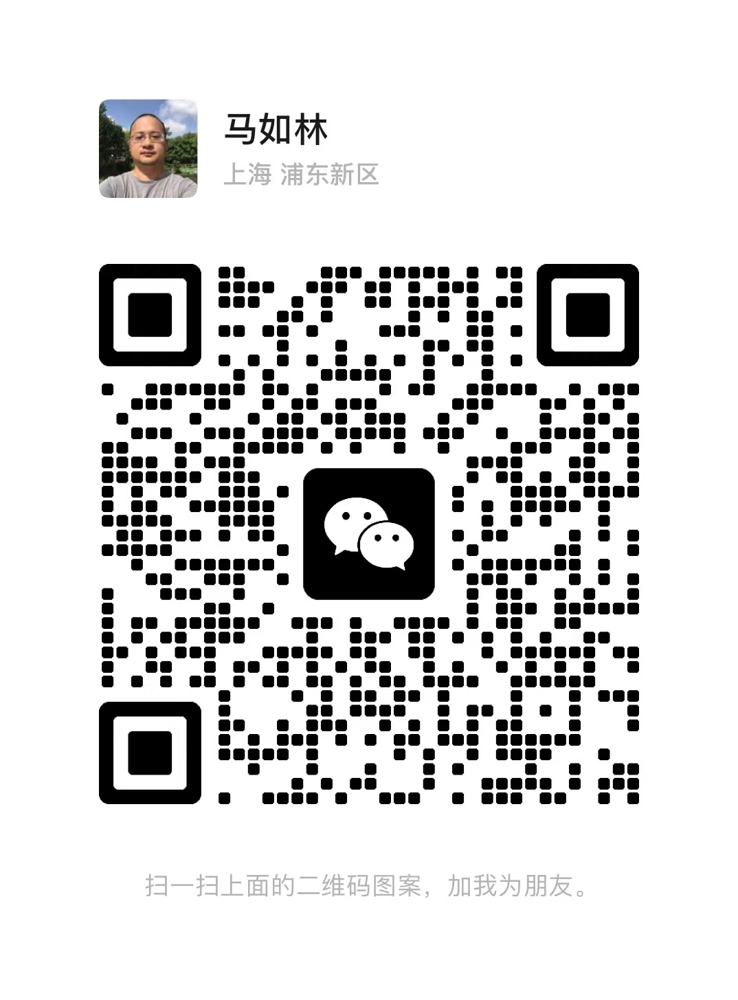
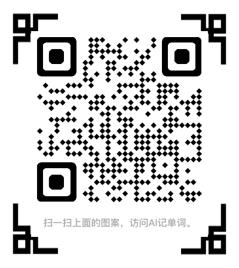
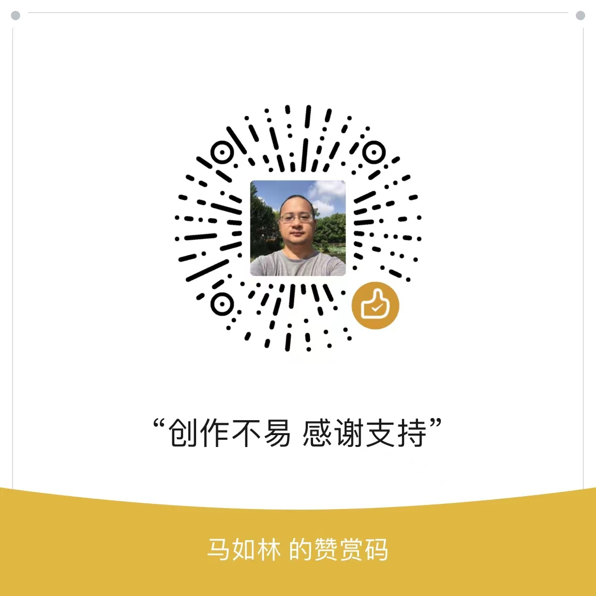

# 字母

作者：马如林
微信：rulinma
电话：15026906099
AI记单词：<https://www.xianglesong.com>

## 前言

语言和文字的产生是人类进化和发展的重要产物，人类获得语言能力，不仅使人类可以进行更为复杂和抽象的思维，也使人类可以进行更为高效的交流与合作。语言的产生奠定了人类文明的基础，使人类可以记录和传播知识，促进科技与文化的发展。人类的发展也推动了语言的变化和丰富。人类不断发明新的工具、创造新的概念，这需要新的语言来描述；人类的迁徙和交流也促进了语言的扩散、变异和融合。语言和人类发展相辅相成并相互促进。

* 英语演变
  * 字母起源拉丁文字，A是因为牛对古人的重要性，首先被创造，B，C等类似，最初有21个字母，后引入了希腊字母Y和Z，从I分离出J，从U分化出V，两个V变成W。主要是拉丁，埃及，希腊，罗马，日耳曼，古印度等语言融合。
* 大写字母主要来自于象形及其衍生意义
  * 人类认识事物的一般特征
* 首先有大写字母，后才有小写字母
  * 小写字母主要是为了书写方便
* 音行义的融汇贯通是学习语言的基础和核心
  * 音也是重要因素，因为考试不容易考，所以往往忽视其重要性
* 逻辑对语言和文字的创造和延续很重要
  * 形到义的衍生一般符合逻辑，人类才能容易理解、记忆并被认可，被传播，被延续

## 字母表

* [A-a](A.md)
  * A字母象形牛角（腓尼基人牛角的象形，古希腊进行倒写，闪米特语族的公牛（ox）的意思，总而言之的一种说法是牛角，同时因为牛对农业社会里的古人很重要，所以放在第一位），从牛角衍生出角，弧度，高，尖，反对，否定，后腿，削弱，工具，第一，重要，开始，农业等意义；也有说法是人的象形。
  * 牛角，角
    * angle（角）
    * and（和：牛轭把两头牛连接在一起）
  * 弧度（牛角弯曲状）
    * arc（弧度）
    * arch（拱形）
    * archer（弓箭手）
  * 高
    * air（空气）
    * Alps（阿尔卑斯山，欧洲最高山）
    * altitude（高度，海拔）
    * astronaut（宇航员）
    * aerospace（航空和航天）
    * astrology（占星术，占星学）
  * 尖
    * arm（武器：原始人的武器是不是尖棍子）
      * army（军队）
      * armed（武装的）
    * arrow（弓箭）
    * aim（瞄准）
    * acid（尖酸刻薄）
    * acute（尖的，敏锐的）
    * acupuncture（针灸）
  * 反对（两个牛角相抵）
    * against（反对）
  * 否定（两个牛角相抵）
    * anarchy（无政府状态）
    * atheism（无神论）
    * argue（争辩）
  * 后退（两个牛角相抵）
    * aback（向后）
    * abort（退出）
  * 削弱（两个牛角相抵）
    * abate（减弱）
    * abbreviate（缩写）
  * 攻击（两个牛角相抵）
    * angry（生气）
    * attack（攻击）
  * 第一
    * alphabet（字母表）
  * 重要
    * ability（能力）
    * administrator（管理者）
  * 开始
    * ancestor（祖先）
  * 农业
    * agriculture（农业，农学，农艺）
  * 人（另一种说法就是类似于人的形状，表示人，代表最基本的活动和情绪等）
    * adult（成年人）
    * act（行动）
    * agree（同意）
    * argue（争论）
    * afraid（害怕）
    * 字母A的发音/ei/、/æ/、/a:/、/ɔ:/、/ə/也像是一个人发出的语气词"哎"，"啊"，"哦"等。不定冠词a和an（用来连接后面的元音）也许就是来源于此。
* [B-b](B.md)
  * B字母象形房屋（有门，屋顶的房子，B在字母表中之所以排在第二位也许是因为对人类的生存来说住的重要性仅次于衣食），从地基衍生出仓库，创立，基础等意义；也有说像怀孕的肚子，从而衍生出身体，凸形等意义；B有2等象形及其衍生意义；小写b有底部的象形意义，b和d也有对称意义；B声音有爆炸的感觉。
  * 地基
    * base（基底）
    * basement（地下室）
  * 仓库
    * barn（谷仓）
    * beer（啤酒）
  * 创立
    * build（建立）
    * building（建筑物）
    * begin（开始）
  * 基础
    * basic（基础的）
  * 孕妇（怀孕的象形）
    * born（出生）
    * bear（生育）
    * birth（生日）
    * baby（婴儿）
    * bean（种子）
    * bare（裸露的）
    * be（是，肚子大了的事实就是是的意思）
  * 身体
    * body（身体）
    * bone（骨头）
    * big（大的）
    * back（后背）
  * 凸形（物）
    * ball（球）
    * balloon（气球）
    * bubble（气泡）
    * bulb（灯泡）
    * belly（腹部）
    * back（后背）
    * bow（弓，弯曲，鞠躬）
    * bell（钟，铃）
    * bun（小圆面包，小长面包）
  * 两个（上下各一个半圆）
    * both（两个）
    * bicycle（自行车）
    * bike（自行车）
    * balance（平衡）
    * bra（胸罩）
    * breast（乳房）
    * brace（括弧）
    * brother（兄弟，2个人才可以成为兄弟）
    * binary（二进制）
    * byte（字节）
    * between（两者之间）
    * brain（脑袋，有左右2个脑子）
    * branch（分支）
    * combine（联合，使连接）
  * 第二
    * beta（第二版）
  * 底部
    * bottom（底部）
  * b和d表示对称
    * bed（床）
    * bird（鸟）
    * bud（花蕾）
    * beard（胡子）
  * 普通话音近棒，条形物，树有关
    * bar（棒）
    * bar（酒吧）
    * bank（堤岸）
    * bus（公共汽车）
    * box（盒子）
    * bamboo（竹）
    * bench（长凳）
    * belt（皮带）
    * bush（灌木）
    * boat（船）
    * barrier（栅栏）
  * 普通话发音爆，爆炸
    * boom（爆炸）
    * bomb（炸弹）
    * burst（爆发）
    * blaze（火焰）
    * bloom（开花）
    * BigBang（宇宙大爆炸）
* [C-c](C.md)
  * C字母的一种说法是山洞的象形，是人类最初居住的地方，用来遮风避雨，抵御酷暑严寒。对于古代的人们来说，天然的山洞自然就成了最佳的栖息之地。从山洞衍生出房子，居住地，文明等意义。也有一种说法是骆驼的驼峰象形。C的象形也有镰刀，弯曲，切割，破碎，分类，农业，圆，口等意义。
  * 洞，房子，居住地
    * city（城市）
    * custom（习俗）
    * country（国家）
  * 文明（农业衍生出文明）
    * civil（文明的，公民的，国民的，平民的）
    * civilian（平民，百姓；平民的，百姓的）
    * civilization（文明，文明社会，文明国家；人类社会；教化，开化）
    * city（城市）
    * country（国家）
    * club（俱乐部）
    * color（色彩（解决生活问题，开始追求精神文明））
  * 文明的副产物（圈养家禽和宠物）
    * cat（猫）
    * cock（公鸡）
    * cow（母牛）
    * cub（幼兽；生育幼兽）
    * calf（小牛，小牛皮）
  * 骆驼（骆驼的驼峰象形，半圆形）
    * camel（骆驼）
  * 镰刀，刀行工具
    * cut（切）
    * chop（砍）
  * 弯曲
    * carve（雕刻）
    * curve（弯曲，曲线）
    * curl（卷发，使成卷状）
    * curly（弯弯曲曲的）
    * crooked（弯的，歪的）
    * creek（小溪，支流）
    * crawl（蠕动，爬行）
    * crab（螃蟹（爬行动物））
  * 切割，破碎
    * cut（切割）
    * crash（坠毁）
    * clash（撞击）
    * crack（破裂声）
  * 分类
    * class（分类）
    * category（种类）
  * 农业（镰刀收割的衍生）
    * corn（玉米）
    * carbon（碳（稻草等火烧了后变成黑碳））
    * can（能，可以（割稻子的一个人））
    * come（来，到达（有农业的地方，喊你过去））
    * core（核心）
    * cake（蛋糕）
    * cafe（咖啡）
  * 圆，半圆
    * circle（圆形）
    * circus（马戏团）
    * circuit（环形，巡回，电路）
    * circular（圆形的，环形的）
    * semi-circle（半圆）
    * coil（绕圈）
    * collar（衣领）
    * curve（弯曲）
    * cycle（循环，周期）
    * cylinder（圆柱体）
    * cup（杯子）
    * can（罐头，容器，装罐）
    * coat（外套）
    * bicycle（自行车）
    * tricycle（三轮车）
    * coin（硬币）
    * cylinder（圆柱体，圆桶）
    * cucumber（黄瓜（长长圆圆的））
    * column（柱，圆柱，栏，纵行）
    * coast（海岸）
    * cave（山洞，洞穴）
    * cage（鸟笼，笼子）
    * ceiling（天花板，顶棚）
    * car（汽车）
    * cab（出租汽车）
    * child（小孩在肚子里的形状是圆形，而且在山洞里养，同时也是文明的延续）
  * 口
    * cry（哭）
    * call（喊）
    * cough（咳嗽）
    * chat（聊天）
    * crazy（疯狂的）
    * chant（唱，歌唱；圣歌）
    * challenge（挑战）
    * choir（唱诗班，合唱团；合唱）
    * chorus（合唱团，歌咏队；齐唱，齐声说）
    * crash（碰撞声，坠毁）
    * cracker（爆竹，黑客（破坏性））
    * code（代码，编码）
    * cast（投掷）
  * C通K（手掌的意思）
    * claw（爪子）
    * clap（拍手；鼓掌）
    * catch（抓住）
    * control（控制）
    * carry（拿）
    * capture（捕获）
    * clap（鼓掌）
    * collect（收集）
    * cover（覆盖，用手捂住）
    * currency（现金）
    * cut（切）
    * cook（厨子，厨师；烹调，煮饭，加热）
    * cash（现金）
    * copy（复制）
    * click（点击）
  * C的部分发音/k/，通汉语的刻
    * carve（雕，刻，切下，割下等意义）
    * cut（切）
    * content（内容）
    * chip（芯片（雕刻和文明的复合））
  * China（接近秦的发音，有可能是是秦朝声明远播的产物；也有说法是印度称古中国为支那的发音传播到西方）
    * China（中国）
    * china（瓷器）
* [D-d](D.md)
  * D字母象形门，把字母D逆时针旋转90度，就是门的形状；也说公元前800年腓尼基人的初始写法是一个朝左的三角形，后来希腊用delta命名，再后来罗马人把右边变成半圆形。从门衍生出分开，家里相关的人、事、物，睡觉意义。D原来的三角形也有武器及抵抗等意义，中文发音也有"抵"的意思。D的半圆形也有圆的意义。古埃及也和死亡有关。
  * 门
    * do（房子里有张嘴，需要做事才可以活下来，或者表示能做事）
    * door（门）
    * domain（领域）
    * domestic（家里的）
  * 分开（门分开内外）
    * divide（分开）
  * 家里的人、物、事等（从门衍生）
    * dad（爸爸）
    * daddy（爸爸）
    * dog（狗）
    * duck（鸭子）
    * deer（鹿）
    * desk（桌子）
    * diner（晚餐）
    * deck（甲板，舱面；装上甲板，装饰）
    * decorate（装饰）
    * decoration（装饰品）
    * dress（服装；穿着）
    * dance（跳舞）
    * dust（灰尘）
    * dirty（肮脏的，弄脏，变脏）
    * dig（挖掘）
    * dead（死亡）
    * death（死亡）
    * dying（垂死的）
  * 睡觉
    * dream（睡觉）
    * dormant（冬眠的）
    * doze（打瞌睡）
    * doss（睡觉，过夜）
    * drowse（瞌睡）
  * 三角形
    * delta（三角形物）
  * 武器、防御、抵挡（三角形的武器衍生出武器、防御等意思）
    * defense（防御）
    * defend（防守，保卫）
    * dart（飞镖）
    * dagger（匕首，短剑）
    * debate（争辩）
    * defeat（击败）
  * 半圆形、圆形
    * day（圆形的太阳和月亮）
    * diary（每天的）
    * dark（黑暗）
    * darkness（黑暗）
    * dawn（黎明，破晓）
    * dull（阴暗的，迟钝的，单调乏味的）
    * daily（每天的；日报）
    * dial（拨打电话（电话的圆盘象形））
    * dish（盘子）
    * disk（磁盘，唱片）
    * disc（圆盘，光盘）
    * disco（迪斯科（上面营造气氛的发光球不断滚动））
    * dot（圆点）
    * dollar（元（硬币的象形））
    * drum（鼓（鼓面的象形））
    * dumpling（饺子（半圆形的象形））
    * den（洞穴）
  * D的发音汉语有低的意思
    * down（向下）
    * drop（滴，落下；丢失）
    * drip（滴下）
    * deep（深处）
    * depth（深度，深处，深奥）
  * D的发音汉语有抵的意思，衍生抵抗，否定，不好
    * deny（否定）
    * disadvantage（不利）
    * disagree（不同意）
    * disapprove（不同意）
    * disband（解散）
    * disclaim（否认）
    * disaster（灾难）
    * disease（疾病）
  * D的发音汉语有多的意思
    * double（双的）
    * dual（双的）
    * dialogue（对话）
    * duplicate（复制）
    * diversify（多样性）
    * different（不同的）
  * 死亡（古埃及字母D的本源是坟墓，与死亡有关。）
    * dead（死亡）
    * danger（危险）
    * dread（恐惧）
  * 十二
    * dozen（十二）
    * december（十二月）
  * 十
    * decade（十年）
    * decimal（十进制的）
    * decimeter（分米）
* [E-e](E.md)
  * E字母的一种说法是象举起双手的人，衍生出祈祷的意义；E字母上下相等，衍生公平、公正、相等的意义；也有象眼睛和窗户的说法，眼睛看到的就有存在的衍生意义；另外小写的e类似椭圆也有其衍生意义。
  * 举起双手的人
    * excite（激动）义
    * exult（欢腾）
  * 祈祷
    * eternity（永生）
    * eager（渴望，渴求）
    * enjoy（欣赏，享受；喜爱；使过得快活）
  * 公平、公正、相等（E的上下2个部分相等）
    * equal（相等；平等的）
    * equality（平等，相等）
    * equity（公平）
    * equivalent（等价的，相等的）
  * 眼睛（E的另一种说法，也有窗户的说法）
    * eye（眼睛）
    * meet（遇见）
    * peek（偷看）
    * see（看见）
    * seek（寻找）
    * seem（看起来）
    * sleep（睡觉）
    * even（傍晚；甚至）
    * evening（晚上，傍晚）
    * eve（除夕）
    * evil（恶魔（晚上出来））
    * elephant（ele是2个眼睛和长鼻子的象形）
    * peer（凝视）
    * peep（偷看，窥视）
    * keep（保持，看守）
    * weep（流泪）
    * bee（蜜蜂（2个眼睛是其显著特征））
    * screen（屏幕）
    * scene（场景）
    * scenery（风景，景色）
  * 每一天（眼睛每天要睡觉）
    * every（每天，每一）
    * each（每个）
    * eat（吃）
  * 出现、存在、向外、超越
    * exist（存在）
    * exit（出口）
    * eager（渴望）
  * 椭圆（小写字母象形）
    * egg（蛋）
    * ellipse（椭圆）
    * eclipse（日蚀、月食）
    * equator（赤道）
    * eddy（旋涡）
  * 字母E的发音也很有意思，好像是人对看到的一切，对听到的一切，不由得发出"咦、唉"等声音。巧合的是，字母 E 在单词中多发/i/、/i:/、/e/等音。
* [F-f](F.md)
  * F字母原始的腓尼基更像Y，古希腊修改为类似现在的F，罗马人再修改为F。从F看就有权杖（表神权和生命），武器，飞鸟（表飞），流动，羽毛，分叉等基础含义。
  * 权杖
    * faith（信仰；信念；信任；忠实）
  * 神权和生命
    * female（女性）
    * life（生命）
    * fertilize（使受精）
    * fertile（肥沃的，能繁殖的）
    * fetal（胎儿）
    * infant（婴儿）
    * fair（公平的）
    * fire（火（古人的传说来自于神））
  * 武器（宝剑的象形）
    * fight（战斗）
    * force（强迫）
  * 飞（鸟飞行的形状变化）
    * fly（飞）
    * flight（飞行，航）
    * float（漂浮）
    * flag（旗帜）
    * flee（逃跑）
    * fleet（敏捷的；舰队）
  * 流动（飞的衍生）
    * flu（流感（空气传播））
    * fluent（流利的）
    * fluency（流利，流畅）
    * flow（流，流动）
    * float（浮动，漂流）
    * flood（洪水）
  * 羽毛
    * feather（羽毛）
    * fur（皮毛）
    * fuzz（绒毛）
  * 分叉（形状上有分叉）
    * fork（刀叉的叉子）
    * fist（拳头）
    * foot（脚）
    * finger（手指）
    * fingernail（指甲盖）
    * fore-finger（食指）
  * 风吹动的植物，发音和汉语的风接近，应该是人类文明的融合
    * fruit（水果）
    * flower（花）
    * forest（森林）
    * flourish（长势好，茁壮成长；繁荣，昌盛）
  * F的发音和汉语飞的发音接近，应该是人类文明的融合
    * fly（飞）
  * F的发音和汉语富的发音接近
    * full（满，富）
    * fee（费）
* [G-g](G.md)
  * G字母是大地上长出东西的象形，并衍生出萌发，新生，伟大等其他意义；也有说法是C的变形，表示带门的房子，也有区分[g]和[k]的发音的说法。
  * 土地
    * give（给（大地给予万物））
    * good（好）
    * geography（地理学）
    * ground（地面）
    * groundless（无根据的）
    * geology（地质学）
    * gravity（重力）
    * god（神）
    * great（伟大）
    * globe（地球）
    * global（全球的，球形的）
    * gain（收获）
    * gold（金子（埋在地下面））
  * 萌发（胚胎的形状）
    * egg（鸡蛋）
    * eggplant（茄子）
    * pig（猪）
    * frog（青蛙）
    * tiger（老虎）
    * big（大）
    * green（绿色）
    * grass（草，草原）
  * 新生
    * gene（基因）
    * grow（生长）
    * age（年龄）
    * gift（礼物）
  * 伟大
    * great（伟大）
    * giant（巨大）
    * gigantic（巨大的）
    * grand（伟大的）
    * grandpa（祖父）
    * grandfather（祖父）
    * grandma（祖母）
    * grandmother（祖母）
  * 门口（C的房子，多个门槛）
    * go（去，走，到达）
    * get（得到）
    * gate（门口）
    * guest（顾客）
    * gap（空隙）
    * gorge（峡谷，凹槽）
    * guide（带领，向导，指南）
    * goal（目标（回家的路））
    * garden（庭院）
  * C、G、K、Q的相互借用，某些G从K而来，也就有手的延伸意义；也有说法像上下臂弯曲形状
    * grab（攫取）
    * grasp（紧握）
    * give（给）
    * govern（统治）
    * government（政府）
  * 普通话勾的发音，衍生出手指；G也有像钩子的形状
    * get（获得）
    * grab（抓取）
    * glove（手套）
    * gun（枪）
    * dig（挖）
    * finger（手指）
    * digit（手指，脚趾；数字）
    * hang（挂，悬挂）
* [H-h](H.md)
  * H字母源自于梯子象形，衍生出高，神，站立的人，安居，小屋等意义；也有说篱笆的象形，衍生出家等意义；通wh，衍生疑问的意义。
  * 梯子，高
    * high（高）
    * height（高）
    * hill（山）
    * heap（堆）
    * hang（悬挂）
    * hall（大厅，礼堂）
    * hot（热）
    * heat（加热）
    * heater（加热器）
    * huge（极大的, 巨大的, 无限的）
  * 神（神在天上或地狱）
    * heaven（天堂）
    * holy（神圣的）
    * harm（伤害）
  * 站立的人
    * he（他（高的人象形））
    * hi（喂）
    * ha（哈，哈哈）
    * his（他的）
    * her（她的，她）
    * him（他）
    * hip（臀部）
    * hug（拥抱）
    * hear（听见）
    * hand（手（人手拉手））
    * heard（头）
    * human（人，人类）
    * hear（听到, 倾听, 听说, 审理（高高的耳朵表示听））
    * heart（心）
    * hair（头发）
    * hit（打）
    * hope（希望）
    * happy（高兴）
    * hero（英雄）
    * hello（喂）
    * horn（角，号角）
    * help（帮助；促进；治疗；补救）
    * have（有；让；拿；从事；允许）
  * 篱笆（多个H的连接象形）
    * hedge（矮篱笆）
    * hinder（阻碍，妨碍）
    * hijack（抢劫）
    * hamper（阻碍，妨碍）
  * 家
    * home（家，住宅；产地；家乡）
    * homey（舒适的；家庭似的；自在的）
    * honey（舒适的；家庭似的；自在的）
    * house（房屋）
    * household（家庭）
    * husband（丈夫）
    * habit（习惯）
    * habitat（栖息地，生活环境）
    * harbor（避难所）
    * haven（安全地，避难所）
    * hotel（酒店）
    * hide（隐藏）
    * halt（停止）
    * here（这里）
    * there（那里）
  * wh通h，表示疑问（天上是什么）
    * who（谁）
    * whose（谁的）
    * which（哪一个）
    * why（为什么）
    * what（什么）
    * when（什么时候）
    * where（哪里）
* [I-i](I.md)
  * I字母从形状上看就是站立的人或直线，也有说是手和手臂的象形；小写i像有头脑的人，衍生出思想；i也像水滴下的样子，衍生出水的意思；i也像火苗的样子，衍生小，圆点等意义；
  * 人（站立的人或思考的人）
    * I（我）
    * identity（身份）
    * identify（识别）
    * idea（思想）
    * idol（偶像）
    * ill（有病的）
    * idle（懒惰的，空闲的）
    * image（想象；影像；形象）
    * images（图像；影像；肖像；想象）
    * imagery（意向；比喻）
    * imaged（想象；反映；象征）
    * icon（画像，肖像，图标）
  * 直线
    * line（线）
    * linear（直线的，线性的，长度的，连续的）
    * linearly（成直线地；在线上的）
    * link（连接）
    * linked（有联系）
    * timeline（时间线）
  * 水
    * ink（墨水）
    * ice（冰）
    * liquid（液体）
    * juice（果汁）
    * oil（油）
    * milk（牛奶）
    * fish（鱼）
    * drip（滴，水滴）
    * information（信息）
  * 火苗
    * ignite（着火，点燃）
    * fire（火）
    * fired（点火，激发）
    * firefighter（消防员）
    * firework（烟花，烟火）
    * fireplace（壁炉）
  * 小、圆点（i象形）
    * little（小的）
    * point（点，观点，要点）
    * tip（尖，顶端，提示）
    * tiny（微小的）
    * minute（分钟）
    * minibus（小型公共汽车）
    * mini（迷你的；超短裙；微型汽车）
    * minimum（最小的；最小值）
    * minimal（极小的，极少的）
    * minimize（使减少到最低限度；贬低，使显得不重要；（尤指在计算机屏幕上）使最小化）
* [J-j](J.md)
  * J字母象形钩子或跳跃的人，衍生出连接、突出等意思；I的变形，衍生出滴水的意义；I思考的人，J实战的人，J比I多了个脚；从Jupiter（木星）也有一些衍生意义；J和Y都是钩子造型，有一定程度互换。
  * 钩子，连接
    * join（连接，加入）
    * joint（连接处, 接合；共同的, 联合的, 连接的, 合办的）
    * jointly（共同地）
    * junction（交叉口，岔道口；汇合处，交叉点）
  * J形状，突出
    * jump（跳，跃；跳过，跃过，跨越；快速移动，突然移动）
    * jogging（慢跑；轻推，轻撞）
    * jiggle（轻摇；抖动；（使）左右摇摆）
    * jut（尖端，突出部分；突出；伸出）
    * jab（刺, 戳, 猛击）
  * 滴水（j上面的水连续下滴）
    * jar（玻璃罐，广口瓶；罐子）
    * jam（果酱；塞满，挤满）
    * juice（果汁；榨（果汁或蔬菜汁））
    * juicy（多汁的，汁液丰富的）
    * jelly（果冻；成胶状；使结冻）
    * jug（壶，罐）
  * 水滴
    * job（慢慢来钱像水滴落下）
    * jet（喷射）
  * Jupiter（木星，神，主管法律和秩序，幸运之神）
    * joy（高兴）
    * joyful（高兴）
    * jolly（快活动，令人高兴的）
    * joke（笑话）
    * judge（法官）
    * juror（陪审员）
    * just（刚刚好）
    * justly（应得的，公正的）
    * justify（正当的）
  * J和Y有一定程度互换
    * juvenile（青少年的，未成年的；青少年，未成年人；同young（青少年的））
    * junior（年幼的，初级的）
  * 音译
    * jeep（吉普车）
* [K-k](K.md)
  * 手的象形，衍生出打结，连接，掌控等意义，也有C、G、K和Q相互替换的衍生意义。
  * 手掌（象形）
    * keep（生计, 维持, 保持）
    * knob（球形把手，门把手）
    * knock（敲门）
    * knife（小刀）
    * kill（杀）
    * keen（锋利的）
    * key（药匙）
    * kit（工具箱，装备，成套工具）
    * kite（风筝）
  * 打结，连接
    * knot（打结；纠缠）
    * knit（编织, 结合）
    * knee（膝盖）
    * kiss（吻；接吻）
  * 掌控
    * know（知道；认识；懂得；了解；熟悉；确信）
    * king（国王）
    * kingdom（王国）
    * knife（小刀，匕首）
  * C、G、K、Q的相互替换
    * control（控制）
    * catch（抓住）
    * capture（抓获）
    * claw（爪）
    * carry（拿，运送）
    * clap（鼓掌）
    * clasp（握紧）
    * collect（收集）
    * cover（覆盖）
    * give（给）
    * grasp（紧握）
    * grab（攫取）
    * get（获得）
    * gesture（手势）
* [L-l](L.md)
  * 鞭子的象形，衍生出权杖，领导，权威，同时L字形也表示长和高的意思，也衍生出活，生活等意义。
  * 鞭子、权杖
    * lash（鞭打；睫毛）
    * lord（主，上帝；）
    * let（让；允许，同意）
  * 引导、带领（一横，一竖表示创作和文字，有文化的人等）
    * letter（字母）
    * learn（学习）
    * lead（引领）
    * leader（领导）
    * lesson（课程）
    * lecture（讲课）
    * lab（实验室）
  * L形
    * leg（腿）
    * lever（杠杠）
    * level（水平）
    * line（线）
    * list（列表）
    * long（长）
    * length（长度）
    * longitude（经线）
    * lace（鞋带）
    * lie（躺平）
    * light（光线）
    * laser（激光）
    * lamp（灯；照亮；发亮）
    * life（生命）
    * live（活着）
    * lion（狮子（象形））
    * lot（很多）
    * lady（女士（身材修长））
    * log（圆木，日志，记录；伐木）
  * 高
    * ladder（梯子）
    * lift（举，升起）
    * loud（高声的，大声的）
    * aloud（大声地）
    * large（大量的，巨大的）
    * tall（高）
    * hall（大厅，礼堂）
    * wall（墙，墙壁）
    * well（井）
    * fall（降落，落下；跌倒，倒塌；秋天，秋季（树叶落下，万物凋敝））
    * launch（火箭发射；发动，发起；上市，发行）
  * 活、生活
    * live（生存，活着；生活在；居住；生长，栖息）
    * liver（肝脏；居民）
    * lively（活泼的，生气勃勃的；热闹的，激烈的；生动有趣的）
    * lives（生活，生命；居住）
    * life（生命，性命；人命；生物，活物；生活，人生；生活方式，阅历）
    * lifetime（一生，终生；寿命，有效期，使用期；一生的，终身的）
    * like（喜欢）
* [M-m](M.md)
  * 水波纹的象形根据埃及人的说法，字母"M"的起源是带有五个波峰的垂直波浪线，象征着水。公元前 1800 年，闪米特人将线减少为三波，腓尼基人又去除了一波。公元前800年，山峰变成之字形并水平翻转，形成了我们今天所知的字母M。也有山的形状，手的形状，跟汉字"爪"非常相似。水、山、手等衍生出强大，壮观，数量，哺乳代表女性，中间等意义。
  * 水
    * marine（海的）
    * moisture（潮湿）
    * marish（沼泽）
    * mercury（水银）
    * milk（牛奶）
    * mud（泥浆）
    * mobile（流动）
  * 壮观、强大
    * magnificent（壮观的）
    * mighty（强大的）
    * magic（魔力的）
    * marvel（奇迹）
    * miracle（奇迹）
    * mad（疯狂的）
    * manic（狂躁的）
  * 数量、多少
    * many（许多的）
    * much（许多的）
    * massive（大量的）
    * more（更多）
    * most（最多）
    * math（数学）
  * 度量
    * measure（度量）
    * metric（公制的）
    * millionaire（百万富翁）
  * 女性（母亲的胸部象形）
    * mum（母亲）
    * mother（母亲）
    * madam（夫人）
    * maiden（姑娘）
    * Miss（小姐）
    * male（女性）
    * marry（嫁；娶；与……结婚 ）
  * 中间的意思
    * middle（中间）
    * midnight（午夜）
  * 山
    * mount（山）
    * mountain（山）
  * 移动（飞鸟震动翅膀）
    * move（移动）
    * movie（电影）
    * migrant（候鸟，移民）
    * migrate（迁移）
  * 手，跟汉字"爪"非常相似
    * my（我的）
    * me（我）
    * man（男人）
    * make（制作）
    * map（地图）
    * money（钱）
    * meet（会，集会；遇见，认识（想象为来自于见面握手））
    * music（音乐）
    * mark（标记）
    * maker（制造者；造物主）
* [N-n](N.md)
  * 埃及符号是字母"N"，它最初看起来像是在代表眼镜蛇或蛇的较大波纹之上的一个小波纹。古闪米特人赋予它音n，象征"鱼"。也有从象形看是鼻子（2个竖线和上面1个横线，类似脸上连在一起的2个鼻孔），也有门形，高等象形和衍生意义等说法。
  * 鼻子
    * nose（鼻子）
    * noise（噪音, 杂音, 响声, 喧闹；谣传；喧闹）
    * noisy（嘈杂的；喧闹的）
    * nap（小睡，打盹儿）
    * nip（夹；捏）
  * 发芽的种子（原始的N左边的竖线是向上的，表示种子发芽形状）
    * new（新的）
    * newly（重新, 最近）
    * now（现在）
    * nut（坚果, 核心, 螺帽）
    * nurse（保育员）
    * nurture（培养）
    * nutrient（养分）
    * nature（自然）
  * 否定（新旧替换的衍生意义）
    * no（否定）
    * not（否定）
    * none（没有）
    * nor（也不）
    * nope（没有）
    * nothing（没有）
    * never（永不）
    * nil（数字0，空）
    * null（空，没有结果）
  * n像上面的横线连接2个竖线，衍生网络，连接等意义
    * neighbor（邻居）
    * near（附近）
    * next（接下来）
    * net（网，网络）
    * nest（巢，窝；安乐窝）
    * node（节点；瘤）
  * 门形
    * in（在...内）
    * inn（小旅馆）
    * open（开门）
  * 高（中间的一横表义）
    * on（在...上）
    * sun（太阳）
    * man（人；男人；人类；丈夫；）
    * woman（妇女；女性；成年女子）
    * human（人的，人类的；人，人类）
    * son（儿子，孩子）
* [O-o](O.md)
  * 古埃及眼睛的象形，就有光学衍生意义，另外也有嘴，圆形等象形及衍生意义。
  * 眼睛
    * observe（观察）
    * obvious（显而易见的）
    * look（看）
    * outlook（观点，看法）
    * video（视频）
  * 嘴，口，说
    * mouth（嘴）
    * throat（喉咙）
    * oral（口头的，口述的）
    * oath（宣誓，诅咒）
    * oh（哦）
    * solo（独唱，独奏）
    * pianio（钢琴）
  * 光学
    * optics（光学）
    * optical（光学的、眼镜的）
  * O形（圆形）
    * on（开）
    * off（关）
    * hole（洞）
    * obesity（肥胖）
    * oblong（椭圆形）
    * oblate（扁圆的）
    * open（开）
    * close（关）
    * moon（月亮）
    * loop（循环）
    * coil（线圈）
    * dot（点）
    * onion（洋葱，洋葱头）
    * orange（橙子，橙色的）
    * noodle（面条）
  * 字母O在单词中常发/ɔː/音，与中文里的汉字"哦、噢、喔"发音有些相似。
  * 与字母C表达的洞穴不同，字母O表达的多是与"口"有关的意思。例如，口述的(oral)、歌剧(opera)、服从(obey)等。从形状上看，字母O与字母C有些相似，但又有点区别。从两组单词中也许可以找到C和O的区别，例如，小圈(circle)和轨迹(orbit)、(卷心菜) cabbage 和洋葱(onion)。含有字母C的单词circle，无论是用来表达马戏团的"火圈"还是《西游记》中孙悟空给唐僧画的"保护圈"，像字母C一样似乎有个"出口"；含有字母O的orbit，则通常用来表示星球的运行轨迹，像字母O一样没有"出口"。另外，cabbage（卷心菜）和onion（洋葱）的叶片，一个是有"开口"的，一个是"闭合"的，跟字母C和O也是非常契合。
* [P-p](P.md)
  * 在古代闪米特语中，今天的字母"P"看起来像一个倒置的"V"，意思是"嘴巴"，腓尼基人将它的顶部变成了斜钩形，公元前200年，罗马人将它向右翻转并闭合环以形成"P"。从P衍生出人，嘴，高，平，尖等意义。
  * 站着的人
    * people（人）
    * public（公共的）
    * play（玩）
    * power（力量，能力；电力，功率，性能；政权，势力）
    * pay（支付）
    * party（政党，党派；聚会，派对；当事人；参加社交聚会）
    * pass（通过，经过）
    * pull（拉；拔；拖）
  * 嘴
    * lip（嘴唇；边缘；口头上的；用嘴唇）
    * phone（电话）
    * play（戏剧）
    * proclaim（宣告）
    * party（聚会）
    * pray（祈祷）
    * parrot（鹦鹉）
  * 纸（嘴的延伸）
    * paper（纸）
    * picture（图）
    * print（打印）
    * page（页；记录；大事件，时期；历史篇章）
  * 尖状
    * pin（针）
    * peak（山峰）
    * point（指，指向；要点，核心问题）
    * punch（冲突）
    * peace（和平）
    * pine（松树）
    * pineapple（菠萝）
    * pick（挑选；采摘；挖）
    * pyramid（金字塔；金字塔形的物体）
    * pierce（（锋利尖锐物体）刺入，刺穿；（在身体某部位）扎眼，穿孔（以佩戴珠宝）；（声或光）穿过，透入）
  * 高
    * up（向上；上涨）
    * top（ 顶端；表面；最高的级别；尽头）
    * pillar（柱子，支柱）
    * pole（杆，柱；地极）
    * polar（极地的，来自极地的）
  * 普通话发音"平"
    * plain（平原）
    * plan（平面图，详图；计划，打算；规划；设计）
    * planning（规划，计划编制；计划，设计，预期）
    * plate（盘子，碟子）
    * plateau（高原）
    * platform（平台；讲台，舞台）
* [Q-q](Q.md)
  * 最初表示猴子的尾巴，被写成一个垂直线穿过的圆圈，后来改写成今天这个形式。疑问的意思我想象嘴巴里的舌头在说话，表示疑问，也有方形的说法，就是Q象形正方形，也有口的象形等及其意义的衍生。
  * 方形
    * square（正方形）
    * quarter（四分之一，正方形四个边，一个就是1/4）
    * quilt（被子，被褥）
  * 口
    * quote（引用，引证）
    * quotation（引用，引文）
    * quarrel（吵架，争吵）
    * quiet（安静的；安定的；不动的；温顺的；安静；和平）
    * quit（退出；离开）
  * 问（疑问，询问）
    * quest（寻求，探求）
    * question（疑问）
    * query（询问）
    * enquiry（询问）
    * inquire（询问）
    * require（要求，命令）
    * requirement（需求，要求）
    * quiz（小测验）
* [R-r](R.md)
  * 人面朝左的轮廓是闪米特人书写的字母"R"的原始形状，意思是"头"，罗马人将它向右转，并添加了一个倾斜的脚。也有说法R上面是太阳的意义，从而衍生出光，发散，圆等意义。
  * 太阳（我们普通话日的发音就是这个，古埃及也用R表示太阳和太阳神）
    * red（红色；红色的）
    * rise（升起，上升，增加）
    * round（圆形的）
    * roll（滚动）
    * rotate（旋转）
    * radius（半径）
    * repeat（重复）
    * rich（富有的；肥沃的；昂贵的）
  * 圆
    * round（圆形的，球形的；圆弧的）
    * around（围绕，环绕；大约；周围，四周）
  * 口
    * read（读）
    * reader（读者， 爱读书的人）
    * reading（阅读）
    * roar（咆哮；吼；轰鸣；咆哮；吼叫；喧闹）
    * rumour（谣言）
    * rap（说唱）
  * 发散
    * rain（下雨）
    * ray（光线）
    * radar（雷电）
    * radial（放射的）
    * radio（收音机；无线电广播设备）
    * radius（半径，辐射范围）
  * 跑，人
    * run（跑）
    * rush（冲，奔跑）
    * race（赛跑，竞赛）
    * rat（老鼠）
    * rabbit（兔子）
    * road（路）
    * ride（骑（车，马））
    * worker（工人）
    * teacher（教师）
    * leader（领导者）
    * doctor（医生）
  * 草，根（r象形植物发芽的形状）
    * root（根；根源；词根；祖先）
    * rose（玫瑰）
    * grass（草）
    * tree（树）
    * father（父亲）
    * mother（母亲）
  * 分支（r象形分支）
    * river（河流）
    * branch（分支，树枝）
    * break（断，碎）
    * crack（破裂，裂开；崩溃，垮掉；砸开，砸碎）
    * crash（撞车，坠毁；猛撞，发出巨响；破产，倒闭，暴跌）
    * spray（喷撒）
    * spread（传播）
  * 中文的日读音类似，都表示太阳
* [S-s](S.md)
  * 字母"S"曾经看起来像一个水平的波浪形W，用来代表弓箭手的弓，罗马人将其翻转到垂直位置，也有埃及的蛇形和S象形说，汉语的水音接近等及其衍生意义。
  * 蛇形（埃及语系）
    * snake（蛇）
  * 光滑
    * smooth（光滑）
    * slide（滑行）
  * 神圣（巫师的权杖一般有蛇形图案）
    * sin（罪恶）
    * sacred（圣神的）
    * saint（圣者）
    * spirit（精神）
    * sky（天空，天色，天堂）
  * 脊椎骨（迦南符号系统）
    * skeleton（骨架）
    * spine（脊柱）
    * stable（稳定的）
    * stem（树干、茎）
  * S形
    * she（她）
    * sister（姐妹）
  * 锯齿形
    * saw（锯；锯开）
    * separate（分开，分离）
    * section（部分）
  * 波浪（波纹形）
    * sea（大海）
    * seal（海豹）
    * sail（航行）
    * sailor（水手）
    * soup（汤）
    * soap（肥皂）
    * sweat（出汗，汗）
    * swim（游泳）
    * ship（船）
  * 摇摆
    * swim（游泳）
    * swing（摆动，摇荡）
    * sway（摇摆）
    * sport（运动，游戏，娱乐，运动会）
    * speed（速度，迅速）
    * slow（慢的, 缓慢的, 迟缓的, 迟钝的, 冷漠的, 落后的）
    * snow（雪, 积雪, 下雪）
  * 转动
    * switch（开关）
    * swap（交换）
  * 声音（S发音同汉语的声）
    * sound（听见）
    * say（说，声音）
    * speak（说话；演讲；表明；陈述）
    * see（看见（寻声看见））
    * seek（寻找（寻声查找））
    * sign（符合，招聘）
    * shout（呼喊, 喊声）
  * 代表元素水，与汉字"水"相似，呈S状，可以表示水、S形的事物与现象。
    * sea（大海）
* [T-t](T.md)
  * 古代闪米特人使用我们今天看到的字母"T"的小写形式。腓尼基人称这个字母为标记。希腊人在字母的顶部添加了十字，以区别于字母"X"。T主要有神、T形、传输、分叉、方向、高、连接及土等象形及衍生意义。
  * 神
    * throne（权杖，王位）
    * theology（神学）
  * 十字
    * table（表格）
    * ten（十）
    * teenage（十几岁的）
    * tenfold（十倍的）
    * two（二，二个）
    * twice（两次；两倍）
  * T形，标记
    * tee（T形物）
    * tag（标记）
    * the（这；那）
    * this（这个）
    * that（那个）
    * these（这些）
    * those（那些）
    * they（他们）
    * their（他们的）
    * them（他们）
  * 传输
    * tell（告诉，说，吩咐）
    * talk（说话；谈论；谈心；谈判）
    * teach（教；教授；教导；教授；讲授；当老师）
    * trade（交易）
    * transfer（传输）
    * trip（旅行）
    * traffic（交通）
    * traverse（横贯）
    * transmit（传输）
    * transport（运输）
    * text（文本，课文；发短信）
  * 三（左，右，下三个部分象形）
    * triangle（三角形）
  * 分叉（从三衍生）
    * tree（树）
    * tribe（部落）
  * 方向（T指示方向）
    * to（到，向...）
  * 高（T上面的一横表示高）
    * top（顶部）
    * tall（高）
    * tower（塔）
    * table（桌子）
  * 连接
    * next（下一个）
    * net（网）
    * connect（连接）
    * twin（双胞胎）
    * two（二）
  * 代表元素土，与汉字"土"形似，呈 T 字形，可以表示土、以及在 大地的事物和现象。
    * tree（树）
  * 感谢（大地馈赠）
    * thank（感谢）
* [U-u](U.md)
  * 公元前1000年，U通Y，后来出现V和W，U和V相互替换，W是2个V，U形有下面、相反、否定、容器、统一和转弯等意义。
  * 下面
    * under（下面）
    * up（向上的；向上）
    * upper（上面的，上部的；较高的）
    * upon（在……之上；即将来临；在上面地；此后）
  * 相反，否定（u和n方向相反）
    * unable（不能的）
  * 容器
    * bucket（桶）
    * cube（立方体）
    * cup（杯子）
  * 统一（容器把东西放一起）
    * unit（单元，单位）
    * unite（使…混合；使…联合；使…团结；团结；联合；混合）
    * union（联盟，协会；工会；联合）
    * universe（宇宙）
    * unique（独一无二的）
    * uniform（全部相同的）
  * 转弯
    * turn（转弯）
* [V-v](V.md)
  * 罗马人互换使用V和U，区别在1400年代左右开始出现。从V的象形上衍生出山谷，容器，空，转折，变化，分开，飞鸟，看见，声音等意义。
  * 山谷
    * valley（山谷）
    * valleys（山谷，凹处）
  * 容器
    * vase（花瓶，（装饰用的）瓶）
    * vessel（容器，器皿）
    * vat（大桶，大盆）
    * void（无效的；空的；无人（居住）的；缺乏的）
  * 倒空，出空
    * vacant（（地方）空着的，无人用的）
    * vacation（（学校的）假期，（法院的）休庭期）
    * vacuum（真空，真空容器；真空吸尘器；空白，空虚；）
    * vain（虚荣的，自负的；徒劳的）
  * 转折（V字形）
    * convert（转变，转换）
    * versus（以……为对手，与……竞争；与……相对，与……相比）
  * 变化
    * variable（变量的；易变的，多变的；时好时坏的；可变的，可调节的；）
    * vary（变化，改变）
    * versatile（多才多艺的，有多种技能的；多用途的，多功能）
    * very（很，非常）
    * verb（动词）
  * 分开（V字形）
    * divide（分，划分）
  * 飞鸟（V字形）
    * vector（向量，矢量）
    * velocity（速度）
  * 看见（飞鸟视角）
    * view（观察；视野；意见；风景）
    * video（视频；录像，录像机）
    * visual（看见的，视觉的）
    * vision（眼力，远见卓识；视力，视觉）
  * 声音（V字形的半开状）
    * voice（声音）
    * vocal（歌唱的；声音的，有声的）
    * vow（誓约, 誓言, 许愿；起誓, 发誓, 郑重宣言；立誓, 起誓要, 郑重地宣布）
    * vowel（元音；母音；元音的）
* [W-w](W.md)
  * 字母"W"起源于中世纪，查理曼大帝的抄写员并排写下了两个"u"，中间用一个空格隔开。当时发出的声音类似于"v"。W由2个V转化而来，W形也有锯齿状的特征，另外W也有水波纹的象形，从而产生波纹，曲折，疑问等衍生意义。
  * 2个V
    * win（赢）
  * 锯齿状（W形）
    * saw（锯）
    * sew（缝纫）
    * paw（脚爪）
    * claw（爪子）
    * chew（咀嚼）
  * 水
    * water（水）
    * wave（波）
    * wash（洗）
    * wet（湿）
    * wax（蜡）
    * well（井）
    * weep（哭泣）
  * 波纹
    * web（网络）
    * wind（风）
    * weather（天气）
  * 曲折
    * way（路）
    * walk（走路）
    * wander（漫游）
    * wheel（轮）
    * worm（虫，软体虫；蠕动）
  * 疑问（水里有什么）
    * who（谁）
    * whom（谁）
    * whose（谁的）
    * what（什么）
    * when（何时）
    * where（哪里）
    * why（为什么）
    * which（哪一个）
* [X-x](X.md)
  * 中世纪可见该字母，主要意义是X的象形及其衍生剪刀，混合，复杂，分叉等意义。
  * X形
    * ax（斧子）
    * tax（税（据说完税单上写个X标记））
    * fix（修理）
    * ox（阉牛；牛）
  * 未知数（笛卡尔出版《几何学》之后，用 x 代 表未知量）
    * X-ray（X射线）
  * 混合
    * mix（混合）
    * box（盒子）
  * 复杂
    * complex（复杂）
  * 分叉
    * exit（退出，出口）
* [Y-y](Y.md)
  * 字母Y是在公元100年由罗马人添加的，Y象形就是分叉、幼苗等意义。
  * 分叉
    * yoke（牛轭）
    * by（旁）
    * bypass（绕路）
    * byway（旁道）
  * 幼苗状
    * you（你）
    * young（幼小的，年轻的）
    * youth（青少年）
    * yellow（稻子成熟了颜色就是黄色）
    * yield（出产）
* [Z-z](Z.md)
  * 腓尼基人意思是"斧头"，基本没有使用，后来希腊和法语系修改为Z并使用，主要使用还是Z象形及其衍生的神秘，闪电等意义。
  * 神秘
    * Zeus（宙斯，希腊的万神之王）
    * maze（迷宫）
    * amaze（惊奇）
    * puzzle（迷）
  * 闪电（Z象形及衍生）
    * zest（热情，光热）
    * zealous（充满激情的）
    * zeal（热情）
  * Z形
    * zigzag（Z行的）
    * zip/zipper（拉链）
    * zebra（斑马）

## 总结

学习一个字母和单词，可从如下几个方面入手考虑：

* （形）形状意义
* （义）衍生意义
* （音）发音意义（通人类、汉语等发音，比如妈妈，mum）
* （替）等价替换（英文的U、V；中文的通假）
* （外）其他文化引入

把字母的形成搞明白，单词的记忆就可以参考，从而做到有的放矢。这个单词为什么由这几个字母组成，道理是什么？合理吗？想通了可能事倍功半，千万不要死记硬背，要活学活用，知其然也知其所以然。

## 参考资料

* [AI记单词](https://www.xianglesong.com)
* [象形记单词](https://book.douban.com/subject/10529960/)
* [巧妙学单词：从象形到读音](https://book.douban.com/subject/30751225/)
* [象形英文](http://product.dangdang.com/23507973.html)
* [象形5000](https://book.douban.com/subject/25782487/)
* [Claude in Slack](https://www.anthropic.com/claude-in-slack)
* [ChatGPT](https://chat.openai.com/chat)
* [Word Power Made Easy](https://book.douban.com/subject/25977798/)
* [用23张图，告诉孩子26个英文字母的来历](https://www.sohu.com/a/344937328_120144900)
* [English alphabet](https://en.wikipedia.org/wiki/English_alphabet)
* [The Origin of the English Alphabet (and all its 26 letters)](https://www.daytranslations.com/blog/origin-english-alphabet)
* [字母的歷史](https://zh.wikipedia.org/wiki/%E5%AD%97%E6%AF%8D%E7%9A%84%E6%AD%B7%E5%8F%B2)
* [英文字母](https://zh.wikipedia.org/wiki/%E8%8B%B1%E6%96%87%E5%AD%97%E6%AF%8)
* 从人和物的视角探讨英文中二十六个拉丁字母的象形本源

## 附录

### 微信

### 微信公众号

### AI记单词

### 赞赏

