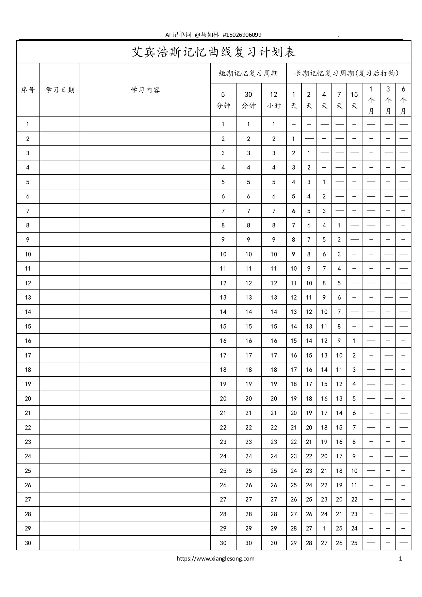
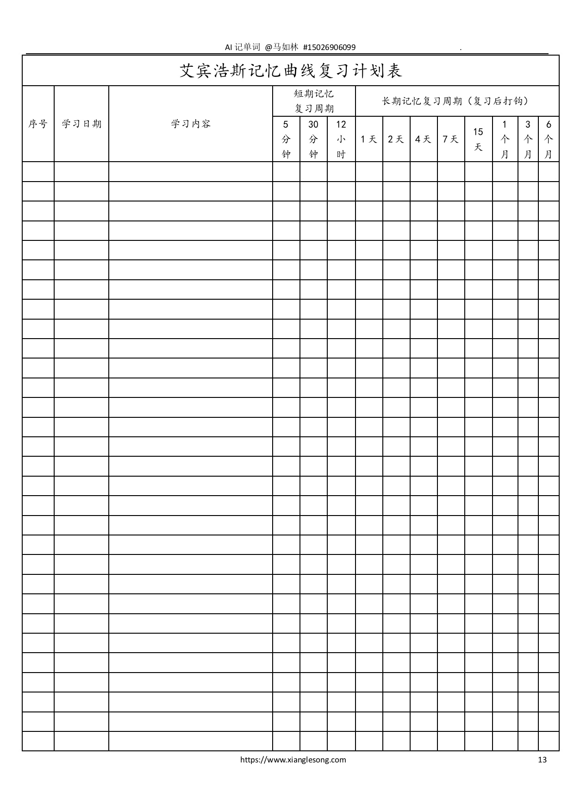

# 记忆

## 记忆方法

人生活在三维立体空间，所以天然的对视频的记忆处理能力远大于图像，同时图像的记忆处理能力也远大于文字，所以利用好这一特性。比如记忆宫殿方法就是其典型应用和实战。另外具体用联想记忆，逻辑推理，还是谐音或者首字母串联等那都是各尽所能，八仙过海各显神通，只要是适合你并有助于你记住的办法就是好办法。

* 视频
* 图像
* 文字

## 遗忘曲线

遗忘曲线是用于表述记忆中的中长期记忆的遗忘率的一种曲线。最早由心理学家赫尔曼·艾宾浩斯通过自己1880-1885年的实验提出。实验中艾宾浩斯使用了一些毫无意义的字母组合。通过记忆这些字母组合，并在一系列时间间隔后检查遗忘率，得到了这一曲线。

|   时长   | 遗忘  | 记住  |
| :------: | :---: | :---: |
| 20分钟后 |  42%  |  58%  |
| 1小时后  |  56%  |  44%  |
|  1天后   |  74%  |  26%  |
|  1周后   |  77%  |  23%  |
| 1个月后  |  79%  |  21%  |

考察从记忆开始，1天后大部分内容被遗忘掉，但是一天之后的遗忘率开始变得平缓。但是，艾宾浩斯的实验中使用的是毫无意义的字母组合，因此，相对于有意义的词汇而言，其实验没有可比性和参照性的指责也同时存在。并且，再认知可能的遗忘与完全遗忘也没有被区分开来。

根据上面的遗忘曲线图，所以有人制定了复习计划，加强记忆。

1. 第一个记忆周期：5分钟
2. 第二个记忆周期：30分钟
3. 第三个记忆周期：12小时
4. 第四个记忆周期：1天
5. 第五个记忆周期：2天
6. 第六个记忆周期：4天
7. 第七个记忆周期：7天
8. 第八个记忆周期：15天

使用艾宾浩斯计划表记单词应该是有一定作用的，未使用过的可以试试，对比看看效果。

关注AI记单词的微信公众号“人工智能记单词”，免费获得艾宾浩斯遗忘曲线（Forgetting curve）计划表（PDF、Word和Excel文件）。

## 参考资料

1. [遗忘曲线](https://zh.wikipedia.org/wiki/遗忘曲线)
