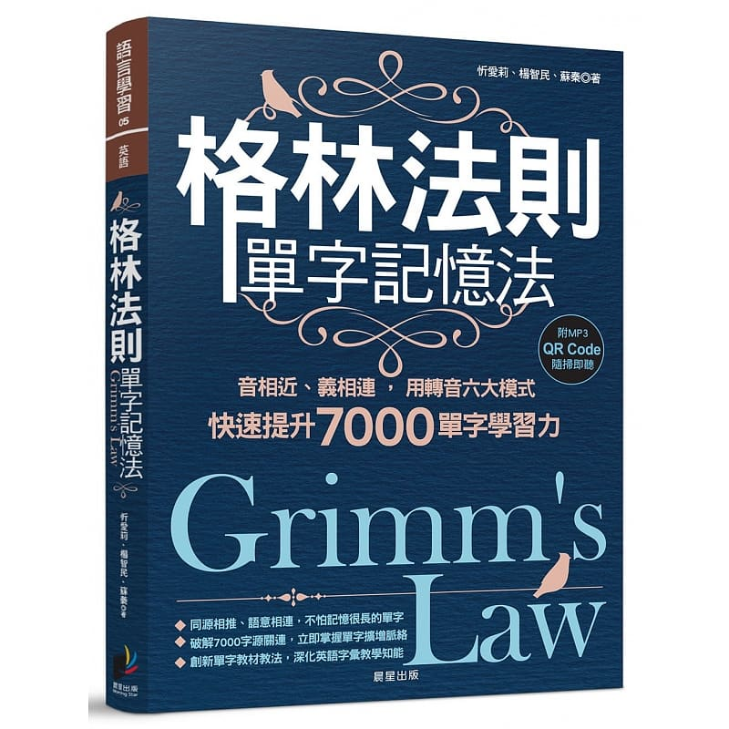
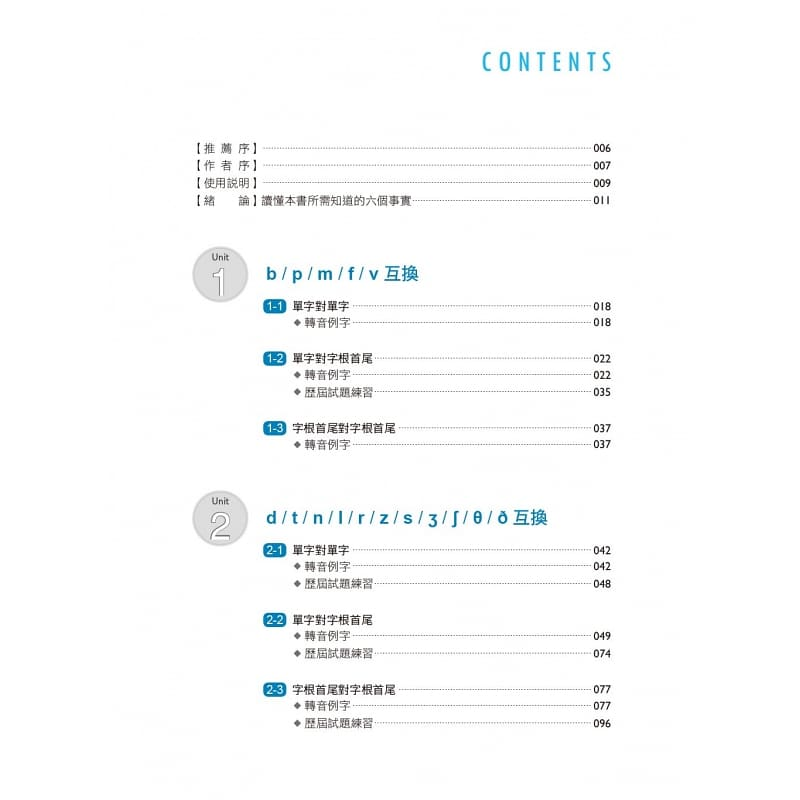
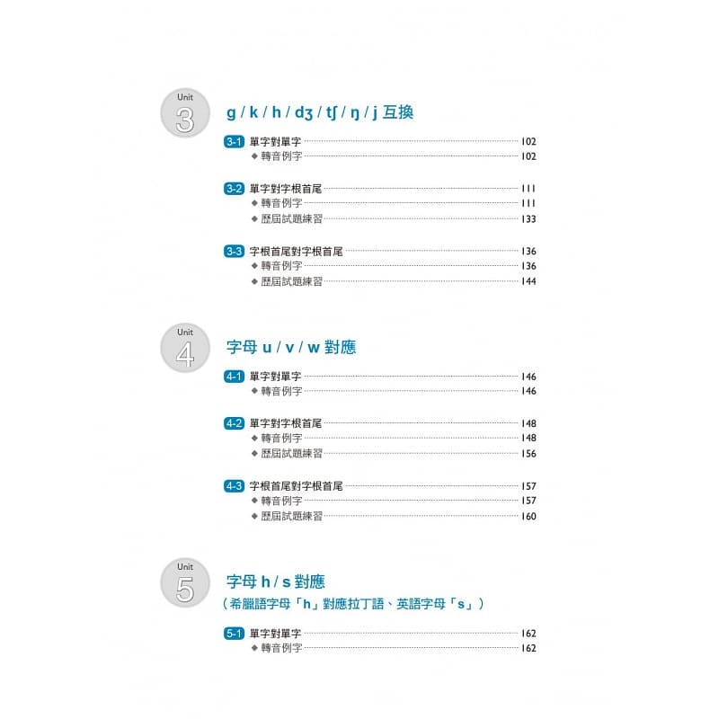
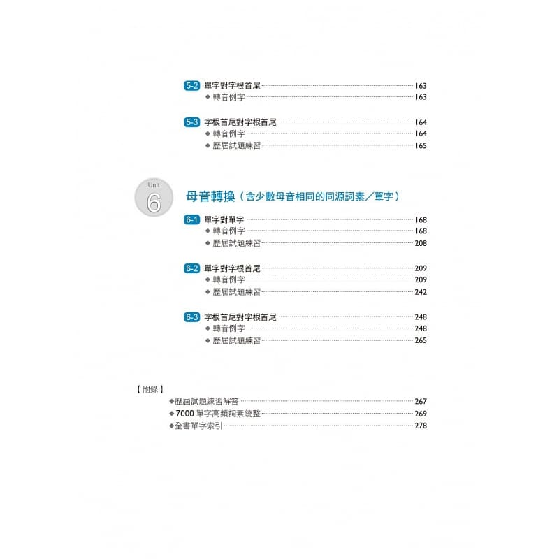
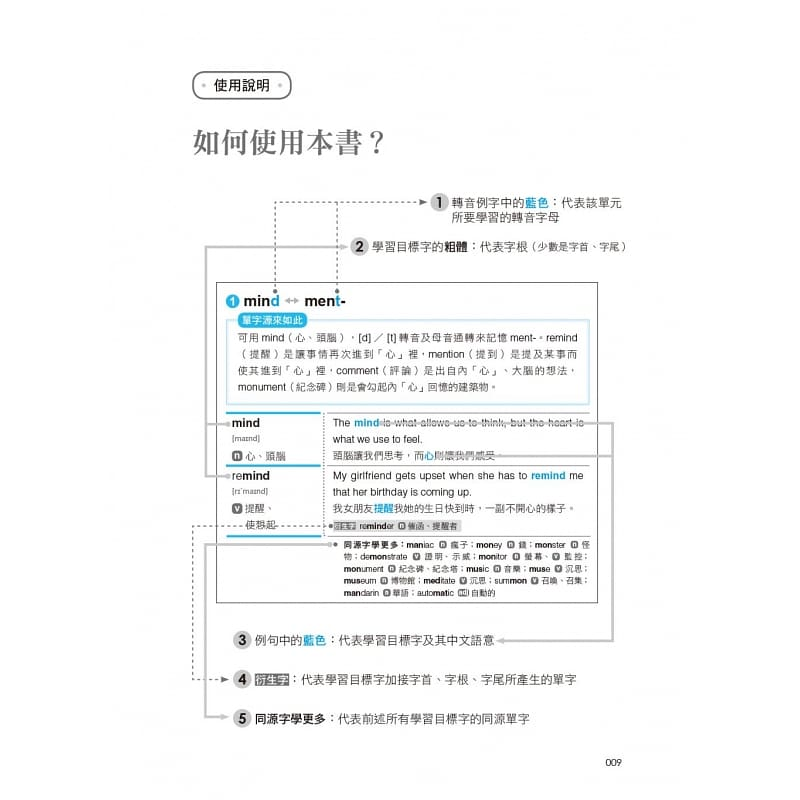

# 音律

音变规律著名的有格林定律和维尔纳定律，格林定律（Grimm's law）是首组发现的音变规律，使得历史音位学诞生成为独立学科，维尔纳定律解决了格林定律的一些困扰，进一步完善​了音变定律。了解音变有助于更好地学习和理解单词。

1806年，施勒格尔首先注意到拉丁语p对应日耳曼语f。1818年，拉斯穆斯·拉斯克把这规律延伸到梵语和希腊语等其他印欧语言，并包含所有辅音。1822年，雅各布·格林在《德语语法（Deutsche Grammatik）》一书中发表了这法则，延伸到包括标准德语。他注意到这规则仍然不能解释许多单词的辅音，这些例外困扰了语言学家数十年，但最终获丹麦语言学家卡尔·维尔纳（Karl Verner）解释，成为维尔纳定律。

## 格林定律

格林定律由三部分组成，这三部分构成了连续的推移链。

* 原始印欧语的清塞音变成原始日耳曼语的清擦音。
* 原始印欧语的浊塞音变成原始日耳曼语的清塞音。
* 原始印欧语的浊送气塞音变成原始日耳曼语的浊的塞音或擦音（同位异音）。

这推移链可以简单表示成

* bʰ→b→p→ɸ
* dʰ→d→t→θ
* gʰ→g→k→x
* gʷʰ→gʷ→kʷ→xʷ

这里每个音向右移一位，得到新音值。注意，原始日耳曼语⟨b⟩、⟨d⟩、⟨g⟩、⟨gw⟩所代表的发音在某些情况是塞音而在另一些情况是擦音，bʰ→b在这里应该理解为bʰ→b／β，其余同理。日耳曼语文献通常将清擦音记做⟨f⟩、⟨þ⟩、⟨h⟩、⟨hw⟩。

* 格林法则的转音到底怎么转？
以 bear< >fer- 为例，可用 bear [b]／[f] 转音、母音通转来记忆 fer-，两者都有「携带」的意思：

  * prefer（更喜欢）：把喜爱的东西「带」到前面
  * refer（归因于）：「带」到背后的原因
  * confer（授予）：把东西一起「带」过来给某人
  * differ（不同）：本意是「带」开来，因而产生差异

更详细的内容，可参考《格林法则单字记忆法》图书。

## 维尔纳定律

维尔纳定律（Verner's law），由卡尔·维尔纳于1875年提出，该定律描述了发生在原始日耳曼语（PGmc）中的一次历史音变，指出了，出现在非重读音节的末尾的清擦音*f, *þ, *s和*x，经过浊化转变成了*b, *d, *z和*g。

以Dessert（甜点）和Desert（沙漠）这个例子来详细说明维尔纳定律在英语发音中的应用：

* 拼写不同：Dessert拼写为双S，Desert为单S。
* 读音相近：Dessert发音为/dɪ'zɜ:t/，Desert发音为/'dezət/或/'di:zət/，末尾的字母组合导致它们的读音很接近。
* 意思不同：Dessert表示甜食，Desert表示沙漠。
* 容易造成记忆混淆：由于拼写、读音和意思的微妙差异，人们在快速理解和表达时很容易混淆这两个词。

根据维尔纳定律，Dessert和Desert这种发音相近但其他要素不同的单词，其记忆难度会大于发音非相近的同义词或反义词。因为人脑在理解和记忆语言信息时，同时考虑拼写、发音和意思，当这三要素出现小的差异时，就容易造成临时的记忆混乱或误用。了解维尔纳定律就要特别注意类似模式的词汇。

## 总结

了解格林定律和维尔纳定律，知道一系列的转音规则，可以从更好的学习英语，破解「简单字」演变成「深难字」的演变模式和特别关注模式。

## 参考文献

1. [格林定律](https://zh.wikipedia.org/wiki/格林定律)
2. [格林法则单字记忆法](http://product.dangdang.com/1551456933.html)
3. [维尔纳定律](https://zh.wikipedia.org/wiki/维尔纳定律)
